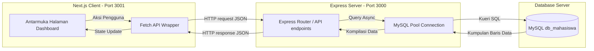

# Sistem Pengelolaan Data Mahasiswa Universitas Al-Azhar Indonesia (UAI)

Sistem Informasi Pengelolaan Data Mahasiswa UAI adalah aplikasi web full-stack modern yang dirancang untuk mendata dan mengelola informasi akademik mahasiswa. Aplikasi ini menggabungkan performa tangguh dari Next.js di sisi client dan keandalan Express.js dengan database MySQL di sisi server.

---

## Daftar Isi
1. [Teknologi dan Stack Modern](#teknologi-dan-stack-modern)
2. [Arsitektur dan Alur Sistem](#arsitektur-dan-alur-sistem)
3. [Struktur Direktori](#struktur-direktori)
4. [Fitur Utama dan Dokumentasi Visual](#fitur-utama-dan-dokumentasi-visual)
5. [Spesifikasi REST API](#spesifikasi-rest-api)
6. [Panduan Instalasi](#panduan-instalasi)
7. [Penyelesaian Masalah](#penyelesaian-masalah)
8. [Informasi Pengembang](#informasi-pengembang)

---

## Teknologi dan Stack Modern

Proyek ini dibangun menggunakan teknologi terbaru guna menciptakan antarmuka yang dinamis, cepat, dan aman:

### Frontend (Client-Side)


*   **Next.js 16.2.9 (App Router)**: Framework React untuk routing berbasis file secara efisien tanpa konfigurasi tambahan.
*   **React 19.2.4**: Library antarmuka komponen deklaratif dengan Manajemen State internal.
*   **TypeScript**: Skema keamanan tipe data statis untuk menghindari kesalahan logika pada proses runtime.
*   **Desain Antarmuka Glassmorphism**: Penggunaan CSS manual kustom dengan variabel tema gelap laut (Dark Oceanic Blue), layout yang responsif, serta animasi transisi fluid.
*   **Lucide React**: Paket ikon berbasis vektor yang seragam dan profesional.

### Backend (Server-Side) dan Database


*   **Express.js 5.2.1**: Framework Node.js yang efisien untuk membangun API RESTful.
*   **MySQL & mysql2**: Penyimpanan data relasional berkinerja tinggi menggunakan arsitektur pooling koneksi asinkronus.
*   **TypeScript (Backend)**: Backend sepenuhnya menggunakan kompilator TypeScript yang memberikan kepastian tipe data lintas environment.
*   **Multer**: Middleware Node.js untuk penanganan unggahan berkas gambar dengan validasi batas ukuran file.

---

## Arsitektur dan Alur Sistem

Sistem ini menerapkan pola arsitektur Client-Server yang terpisah secara independen (decoupled):



---

## Struktur Direktori

```text
Pengelolaan Data Mahasiswa/
├── screenshots/               # Penyimpanan visual tangkapan layar
├── README.md                  # Dokumentasi utama proyek
├── backend/                   # Direktori Backend (Express + TypeScript)
│   ├── src/
│   │   ├── config/            # Konfigurasi database connection pool
│   │   ├── controllers/       # Logika utama pengendalian permintaan API
│   │   ├── middlewares/       # Penengah keamanan dan unggahan file (Multer)
│   │   ├── routes/            # Rute definisi endpoint REST API
│   │   ├── app.ts             # Registrasi middleware dan struktur aplikasi
│   │   └── server.ts          # Titik masuk eksekusi server API
│   ├── uploads/               # Penyimpanan statis gambar mahasiswa
│   ├── db_mahasiswa.sql       # Script inisialisasi tabel dan data relasional
│   └── seed.ts                # Skrip injeksi data awal ke dalam database
│
└── datamahasiswanafi/         # Direktori Frontend (Next.js + TypeScript)
    ├── src/
    │   ├── app/
    │   │   ├── globals.css    # Desain, variabel warna, animasi, & layout CSS
    │   │   ├── layout.tsx     # Komposisi antarmuka induk Next.js
    │   │   └── page.tsx       # Komponen halaman Dashboard Utama
    │   ├── components/        # Modul antarmuka independen yang dapat digunakan ulang
    │   │   ├── DashboardCard.tsx  # Kartu analisis statistik mahasiswa
    │   │   ├── MahasiswaForm.tsx  # Antarmuka input penambahan dan pengeditan data
    │   │   ├── MahasiswaTable.tsx # Tabel penyajian data mahasiswa beserta lightbox
    │   │   ├── ConfirmModal.tsx   # Dialog konfirmasi aksi penghapusan
    │   │   └── Notification.tsx   # Sistem notifikasi toast interaktif
    │   └── lib/
    │       └── api.ts         # Wrapper komunikasi jaringan dengan abstraksi endpoint
    └── .env.local             # Konfigurasi akses jaringan frontend
```

---

## Fitur Utama dan Dokumentasi Visual

Sistem dilengkapi dengan sekumpulan fungsionalitas manajemen data akademik terpadu:

### 1. Dashboard Statistik Utama (Main Page)
Halaman utama menyajikan kartu analitik dinamis (total mahasiswa, total program studi, dan diversifikasi angkatan) bersama dengan tabel daftar mahasiswa. Desain visual dikemas dalam konsep estetika profesional Dark Glassmorphism.


### 2. Pendaftaran Mahasiswa Baru (Create)
Fasilitas formulir reaktif yang mendukung penambahan data akademik dasar beserta unggahan pasfoto. Validasi sisi server akan menjamin keunikan Nomor Induk Mahasiswa (NIM).


Setelah data berhasil disimpan, antarmuka akan menampilkan notifikasi sukses otomatis di layar.


### 3. Modifikasi Data Mahasiswa (Update)
Data yang ada dapat ditarik kembali ke dalam formulir secara otomatis untuk direvisi. Sistem turut memfasilitasi pratinjau (preview) pasfoto yang telah tersimpan beserta opsi untuk menghapus atau menukarnya.


Keberhasilan operasi pengeditan akan divalidasi langsung secara visual.


### 4. Konfirmasi Penghapusan Data (Delete)
Mencegah kerugian akibat kelalaian operasional melalui integrasi dialog kotak konfirmasi khusus (Confirm Modal). Pembersihan entitas pada basis data juga akan menghapus berkas foto terkait pada server untuk optimalisasi ruang simpan.


---

## Spesifikasi REST API

Antarmuka pemrograman aplikasi (API) mewajibkan struktur JSON.

### 1. Mengambil Entitas Mahasiswa
*   **Metode / Endpoint**: `GET /api/mahasiswa`
*   **Format Respons (200 OK)**:
    ```json
    {
      "message": "Data mahasiswa berhasil diambil",
      "meta": {
        "total": 50,
        "totalPage": 5,
        "totalAngkatan": 3
      },
      "data": [ ... ]
    }
    ```

### 2. Registrasi Entitas Mahasiswa
*   **Metode / Endpoint**: `POST /api/mahasiswa`
*   **Payload Form-Data**: Berisi atribut `nim`, `nama`, `prodi_id`, `angkatan`, dan lampiran `foto`.
*   **Format Respons Sukses (201 Created)**: Konfirmasi data ditambahkan dengan identitas objek yang diciptakan.
*   **Format Respons Gagal (400 Bad Request)**: Penolakan akibat NIM ganda atau input invalid.

### 3. Revisi Entitas Mahasiswa
*   **Metode / Endpoint**: `PUT /api/mahasiswa/:id`
*   **Deskripsi**: Mengubah nilai atribut objek spesifik. Mendukung penghapusan gambar melalui parameter boolean flag form-data `removeFoto`.

### 4. Eliminasi Entitas Mahasiswa
*   **Metode / Endpoint**: `DELETE /api/mahasiswa/:id`
*   **Deskripsi**: Penghancuran rekam basis data secara permanen sesuai dengan identitas parameter.

---

## Panduan Instalasi

### Prasyarat Instalasi
1. Node.js (Disarankan versi LTS v18 ke atas).
2. MySQL Server (XAMPP, Docker, atau instalasi asli).

### Fase 1: Basis Data
1. Aktifkan koneksi MySQL Anda.
2. Buat skema database baru:
   ```sql
   CREATE DATABASE db_mahasiswa CHARACTER SET utf8mb4;
   ```
3. Navigasi menuju root proyek dan migrasikan struktur tabel:
   ```bash
   mysql -u root -p db_mahasiswa < backend/db_mahasiswa.sql
   ```

### Fase 2: Backend (Express Server)
1. Pindah ke direktori backend:
   ```bash
   cd backend
   ```
2. Resolusi paket dependensi:
   ```bash
   npm install
   ```
3. Eksekusi lingkungan server lokal (Port 3000):
   ```bash
   npm run dev
   ```

### Fase 3: Frontend (Next.js Client)
1. Buka sesi terminal baru dan pindah ke area frontend:
   ```bash
   cd datamahasiswanafi
   ```
2. Resolusi paket dependensi:
   ```bash
   npm install
   ```
3. Operasikan mode pengembang (Port 3001):
   ```bash
   npm run dev
   ```

---

## Penyelesaian Masalah

1. **Kegagalan Koneksi Database**: 
   Verifikasi bahwa layanan MySQL beroperasi. Validasi parameter login (nama pengguna, kata sandi, dan host) di dalam `backend/src/config/database.ts`.
2. **Kendala Gambar Profil Pecah (Broken Image)**: 
   Pastikan port operasional backend bertepatan dengan konfigurasi alamat `NEXT_PUBLIC_BACKEND_URL` di berkas `.env.local` frontend.
3. **Konflik Port Berjalan**: 
   Jika menemukan indikasi *EADDRINUSE*, silakan hentikan layanan bersangkutan yang menyita port 3000 atau 3001.

---

## Informasi Pengembang

Dokumentasi rancang bangun sistem ini dikompilasi oleh:

**Muhammad Nafi Azka Soleiman**  
**0102522017**  
Program Praktikum Front End Next JS untuk Backend Express JS  
**Universitas Al-Azhar Indonesia**
