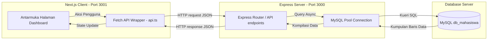
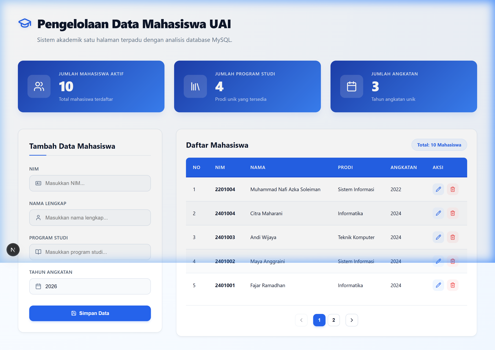
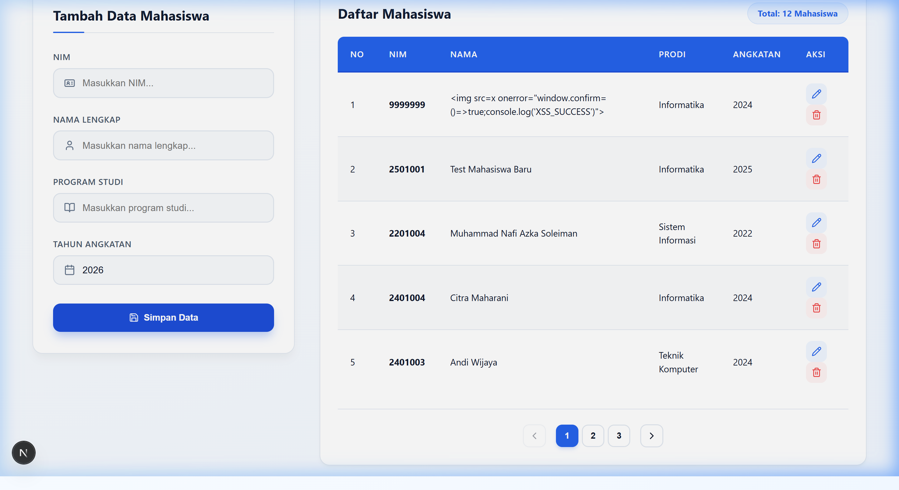
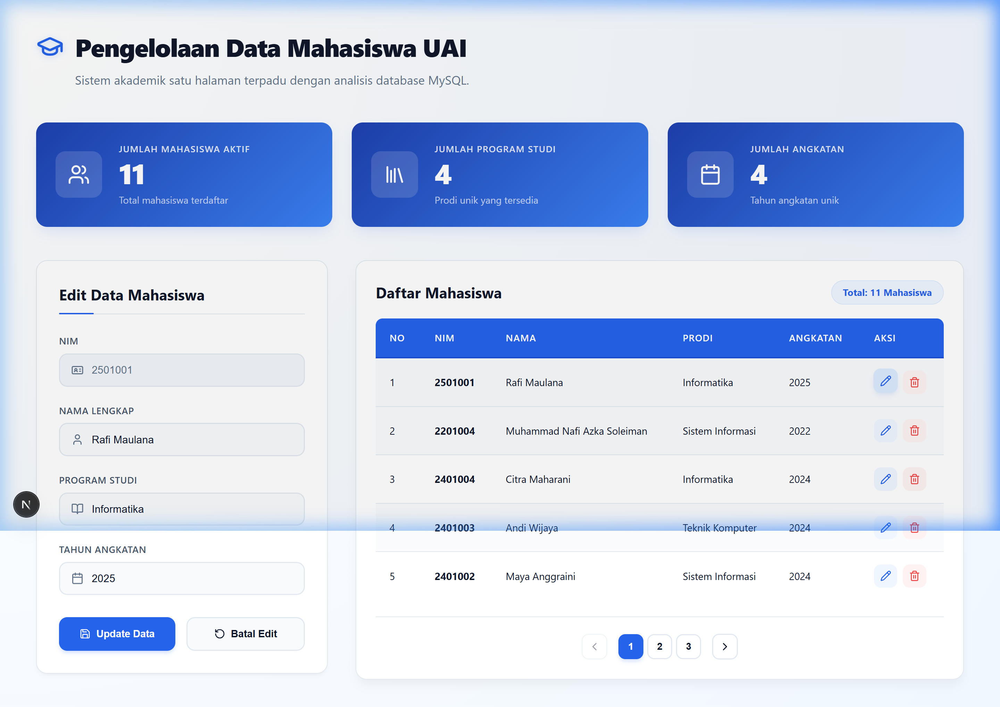
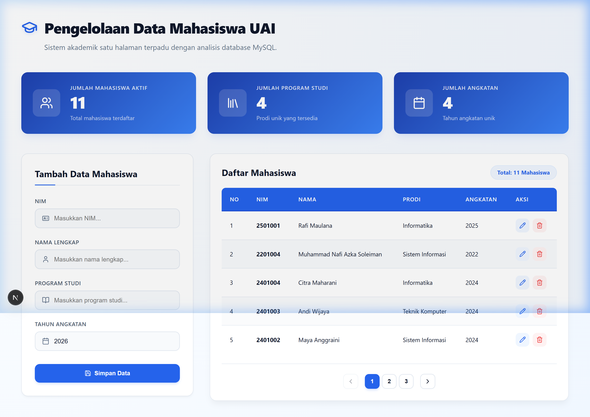
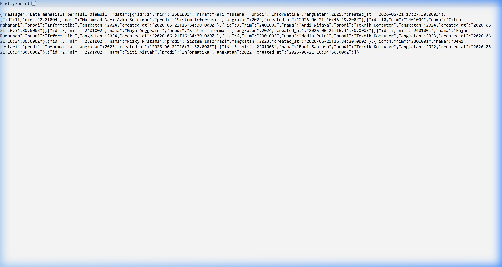

# 🎓 Sistem Pengelolaan Data Mahasiswa Universitas Al-Azhar Indonesia (UAI)

Sistem Informasi Pengelolaan Data Mahasiswa UAI adalah aplikasi web *full-stack* modern dan premium yang dirancang untuk mendata dan mengelola informasi akademik mahasiswa. Aplikasi ini menggabungkan performa tangguh dari **Next.js** di sisi *client* dan keandalan **Express.js** dengan database **MySQL** di sisi *server*.

---

## 📌 Daftar Isi
1. [Teknologi & Stack Modern](#%EF%B8%8F-teknologi--stack-modern)
2. [Arsitektur & Alur Sistem](#-arsitektur--alur-sistem)
3. [Struktur Folder & Direktori](#-struktur-folder--direktori)
4. [Fitur Utama & Screenshot Aplikasi](#-fitur-utama--screenshot-aplikasi)
5. [Spesifikasi & Dokumentasi REST API](#-spesifikasi--dokumentasi-rest-api)
6. [Langkah Instalasi & Penggunaan](#-langkah-instalasi--penggunaan)
7. [Panduan Troubleshooting & Solusi](#-panduan-troubleshooting--solusi)
8. [Informasi Pengembang](#-informasi-pengembang)

---

## 🛠️ Teknologi & Stack Modern

Proyek ini dibangun menggunakan teknologi terbaru guna menciptakan antarmuka yang dinamis, cepat, dan aman:

### Frontend (Client-Side)


*   **Next.js 16.2.9 (App Router)**: Framework React untuk routing berbasis file secara efisien tanpa konfigurasi tambahan.
*   **React 19.2.4**: Library antarmuka komponen deklaratif dengan *State Management* (React hooks seperti `useState`, `useEffect`, dan `useCallback`).
*   **TypeScript**: Skema keamanan tipe data statis (*strong typing*) untuk menghindari kesalahan logika di runtime.
*   **Vanilla CSS System**: Penggunaan CSS manual kustom dengan variabel tema biru-putih premium, layout grid yang fleksibel, efek hover interaktif, serta animasi transisi yang modern.
*   **Lucide React**: Paket ikon berbasis vektor yang seragam dan elegan.

### Backend (Server-Side) & Database


*   **Express.js 5.2.1**: Framework Node.js yang efisien untuk membangun API RESTful.
*   **MySQL & mysql2 (Promise-based)**: Penyimpanan data relasional berkinerja tinggi menggunakan pooling koneksi asinkronus (`mysql.createPool`).
*   **TypeScript (Backend)**: Backend sepenuhnya menggunakan kompilator TypeScript (`tsconfig.json`) dan dieksekusi menggunakan `ts-node` secara real-time.
*   **CORS & Dotenv**: Keamanan kebijakan asal silang (*cross-origin*) dan manajemen variabel lingkungan server yang terisolasi.

---

## ⚡ Arsitektur & Alur Sistem

Sistem ini menerapkan pola arsitektur **Client-Server** yang didecouple sepenuhnya:



---

## 📂 Struktur Folder & Direktori

```text
Pengelolaan Data Mahasiswa/
├── screenshots/               # Penyimpanan visual tangkapan layar fitur
├── README.md                  # Dokumentasi utama proyek (file ini)
├── backend/                   # Direktori Backend (Express + TypeScript)
│   ├── src/
│   │   ├── db.ts              # Konfigurasi MySQL connection pool & pooling
│   │   └── server.ts          # REST API endpoints, routing, dan handler
│   ├── db_mahasiswa.sql       # Script SQL untuk database & data dummy awal
│   ├── cleanDb.js             # Skrip pembersih data database
│   ├── package.json           # Defisini skrip & paket dependensi backend
│   └── tsconfig.json          # Konfigurasi compiler TypeScript backend
│
└── datamahasiswanafi/         # Direktori Frontend (Next.js + TypeScript)
    ├── src/
    │   ├── app/
    │   │   ├── globals.css    # Desain, variabel warna, & layout CSS kustom
    │   │   ├── layout.tsx     # Layout global Next.js
    │   │   └── page.tsx       # Komponen halaman Dashboard Utama
    │   ├── components/        # Modul komponen mandiri reusable
    │   │   ├── DashboardCard.tsx  # Kartu analisis statistik mahasiswa
    │   │   ├── MahasiswaForm.tsx  # Form input (tambah/edit data)
    │   │   ├── MahasiswaTable.tsx # Tabel data mahasiswa dengan pagination
    │   │   └── Notification.tsx   # Alert melayang penanda sukses/error
    │   └── lib/
    │       └── api.ts         # Wrapper Fetch API dengan generic response handler
    ├── .env.local             # Tautan URL API Backend (http://localhost:3000/api)
    └── package.json           # Definisi skrip & paket dependensi frontend
```

---

## ⚡ Fitur Utama & Screenshot Aplikasi

### 1. Dashboard Ringkasan Statistik & Halaman Utama (Read)
*   **Analisis Otomatis**: Secara dinamis menghitung total mahasiswa, prodi unik, dan angkatan unik langsung dari dataset yang diperoleh dari database.
*   **Tampilan Elegan**: Skema gradasi warna biru gelap premium yang bersih, dilengkapi *card layout* serta efek interaktif.



### 2. Pendaftaran Mahasiswa Baru (Create)
*   **Formulir Reaktif**: Form akan mendeteksi tipe masukan dan memiliki input wajib terproteksi (*required fields*).
*   **Validasi Keunikan NIM**: Mencegah duplikasi NIM di tingkat database melalui pengecekan di sisi server.
*   **Notifikasi Toast**: Memberikan alert sukses secara melayang yang otomatis tertutup dalam waktu 4 detik.



### 3. Pembaruan Data Dinamis (Update)
*   **Pengenalan Otomatis**: Menekan tombol edit (ikon **Pencil**) akan langsung memuat data mahasiswa ke dalam form dan merubah mode form menjadi **Edit Data**.
*   **Batal Fleksibel**: Tombol **Batal Edit** disediakan untuk memulihkan keadaan form ke mode tambah secara instan.



### 4. Penghapusan Data Aman (Delete)
*   **Konfirmasi Alert**: Sebelum data benar-benar dihapus, pop-up konfirmasi bawaan browser akan dimunculkan guna mengamankan data dari tindakan yang tidak disengaja.
*   **Update Instan**: Setelah data dihapus, dashboard statistik dan tabel diperbarui otomatis tanpa memuat ulang seluruh halaman (*Single Page App experience*).



### 5. Backend REST API Response
*   **Struktur API Responsif**: Output JSON konsisten yang ramah dibaca dan diintegrasikan oleh client apa pun.



---

## ⚙️ Spesifikasi & Dokumentasi REST API

Semua request payload dan response menggunakan format **Content-Type: `application/json`**.

### 1. Mengambil Semua Data Mahasiswa
*   **Endpoint**: `GET /api/mahasiswa`
*   **Deskripsi**: Mengambil seluruh daftar mahasiswa terdaftar, diurutkan berdasarkan tanggal pendaftaran terbaru.
*   **Format Respons Sukses (Status Code: `200 OK`)**:
    ```json
    {
      "message": "Data mahasiswa berhasil diambil",
      "data": [
        {
          "id": 1,
          "nim": "2201001",
          "nama": "Ahmad Fauzi",
          "prodi": "Informatika",
          "angkatan": 2022,
          "created_at": "2026-06-21T09:30:00.000Z"
        }
      ]
    }
    ```

### 2. Menambahkan Mahasiswa Baru
*   **Endpoint**: `POST /api/mahasiswa`
*   **Deskripsi**: Menyimpan mahasiswa baru ke dalam database.
*   **Request Payload**:
    ```json
    {
      "nim": "2201005",
      "nama": "Farhan Zulkarnaen",
      "prodi": "Informatika",
      "angkatan": 2022
    }
    ```
*   **Respons Sukses (Status Code: `201 Created`)**:
    ```json
    {
      "message": "Data mahasiswa berhasil ditambahkan",
      "data": {
        "id": 11,
        "nim": "2201005",
        "nama": "Farhan Zulkarnaen",
        "prodi": "Informatika",
        "angkatan": 2022,
        "created_at": "2026-06-22T01:00:00.000Z"
      }
    }
    ```
*   **Respons Error - NIM Duplikat (Status Code: `400 Bad Request`)**:
    ```json
    {
      "message": "nim tidak boleh duplikat"
    }
    ```

### 3. Memperbarui Data Mahasiswa
*   **Endpoint**: `PUT /api/mahasiswa/:id`
*   **Deskripsi**: Memperbarui informasi nama, prodi, nim, atau angkatan mahasiswa berdasarkan ID parameter.
*   **Request Payload**:
    ```json
    {
      "nim": "2201001",
      "nama": "Ahmad Fauzi Hasibuan",
      "prodi": "Sains Data",
      "angkatan": 2022
    }
    ```
*   **Respons Sukses (Status Code: `200 OK`)**:
    ```json
    {
      "message": "Data mahasiswa berhasil diperbarui"
    }
    ```

### 4. Menghapus Data Mahasiswa
*   **Endpoint**: `DELETE /api/mahasiswa/:id`
*   **Deskripsi**: Menghapus data mahasiswa secara permanen dari database berdasarkan ID.
*   **Respons Sukses (Status Code: `200 OK`)**:
    ```json
    {
      "message": "Data mahasiswa berhasil dihapus"
    }
    ```

---

## 🚀 Langkah Instalasi & Penggunaan

### Prasyarat Sebelum Instalasi
*   **Node.js** terpasang di komputer Anda (Disarankan versi LTS, v18 atau yang lebih baru).
*   **MySQL Server** aktif (bisa menggunakan **XAMPP**, Laragon, Docker, atau MySQL Installer).

---

### Langkah 1: Persiapan Database MySQL
1. Buka antarmuka manajemen database Anda (seperti **phpMyAdmin** atau DBeaver).
2. Buat database baru bernama `db_mahasiswa`:
   ```sql
   CREATE DATABASE db_mahasiswa CHARACTER SET utf8mb4 COLLATE utf8mb4_unicode_ci;
   ```
3. Impor tabel dan data dummy awal dengan mengunggah atau mengeksekusi perintah SQL dari berkas `backend/db_mahasiswa.sql`. Melalui CLI MySQL:
   ```bash
   mysql -u root -p db_mahasiswa < backend/db_mahasiswa.sql
   ```

---

### Langkah 2: Konfigurasi & Menjalankan Backend Server
1. Masuk ke folder backend melalui Command Prompt / Terminal:
   ```bash
   cd backend
   ```
2. Pasang modul dependensi Node.js:
   ```bash
   npm install
   ```
3. *(Opsional)* Jika database MySQL Anda menggunakan password, Anda bisa menambahkan file `.env` di dalam folder `backend/` dengan isi:
   ```env
   PORT=3000
   DB_HOST=localhost
   DB_USER=root
   DB_PASSWORD=isi_password_mysql_anda
   DB_NAME=db_mahasiswa
   ```
4. Jalankan backend server dalam mode pemantauan developer (*nodemon*):
   ```bash
   npm run dev
   ```
   Server backend akan berjalan di **`http://localhost:3000`**.

---

### Langkah 3: Konfigurasi & Menjalankan Frontend Next.js
1. Buka jendela terminal baru, lalu masuk ke folder frontend:
   ```bash
   cd datamahasiswanafi
   ```
2. Pasang modul dependensi Next.js:
   ```bash
   npm install
   ```
3. Pastikan konfigurasi berkas `.env.local` telah merujuk ke URL API backend Express:
   ```env
   NEXT_PUBLIC_API_URL=http://localhost:3000/api
   ```
4. Jalankan client dalam mode development:
   ```bash
   npm run dev
   ```
   Aplikasi client Next.js siap diakses melalui peramban browser di **`http://localhost:3001`**.

---

## 🛠️ Panduan Troubleshooting & Solusi

### 1. Masalah: Gagal Mengambil Data / Error Koneksi Backend
*   **Gejala**: Halaman memuat tanpa data, muncul alert notifikasi merah "Failed to fetch" atau "Terjadi kesalahan pada server".
*   **Solusi**: 
    1. Pastikan database MySQL Anda di XAMPP / MySQL Service sudah dalam kondisi **Running**.
    2. Cek apakah server backend sudah menyala dengan menjalankan `npm run dev` pada direktori `backend` dan tidak ada port bentrok.
    3. Pastikan konfigurasi user, password, dan port MySQL di berkas `backend/src/db.ts` atau `.env` backend sudah benar.

### 2. Masalah: Masalah Kebijakan CORS
*   **Gejala**: Konsol browser menampilkan error bermotif *Cross-Origin Request Blocked*.
*   **Solusi**: Server Express telah terkonfigurasi untuk menerima origin `http://localhost:3001` secara default (lihat `backend/src/server.ts`). Pastikan Anda membuka frontend pada port `3001` dan bukan port default Next.js `3000`.

### 3. Masalah: Port Terpakai (Port Already in Use)
*   **Gejala**: Error `EADDRINUSE: address already in use :::3000`.
*   **Solusi**: Port `3000` sedang dipakai oleh proses lain. Anda bisa mematikan proses tersebut atau merubah port server di `backend/src/server.ts` serta menyesuaikan `NEXT_PUBLIC_API_URL` pada `.env.local` frontend.

---

## 🧑‍💻 Informasi Pengembang

Dokumentasi ini disusun oleh pengembang proyek sebagai syarat penyelesaian Modul Praktikum:

**Muhammad Nafi Azka Soleiman**  
**0102522017**  
Praktikum Front End Next JS untuk Backend Express JS  
**Universitas Al-Azhar Indonesia**
